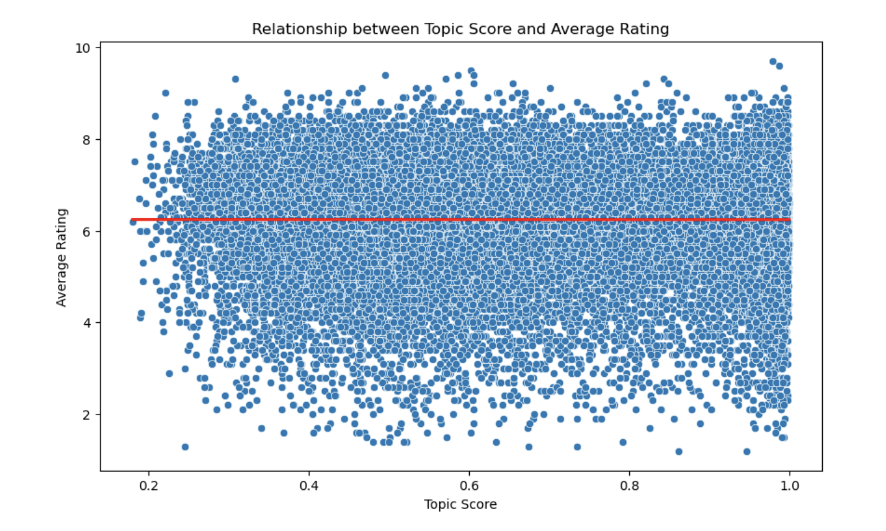

---

# 🍀 Get Ready 🍀

**Writers! Directors! Producers!** Are you ready to embark on a journey to find out all the tips and tricks on how to make a great movie? Our pursuit resembles crafting a ‘cheat sheet’ —a thorough manual— that aims to unravel the necessary elements to create a _truly exceptional_ film that will leave its marks on viewers. Throughout this expedition, you will get a taste of a variety of factors which impact a movie's IMDB rating. Whether it’s the release date or the languages the movie was translated to, we didn’t leave a single stone unturned! Shall we get started?

  

---

## Data Landscape

Our analysis begins with the CMU movie dataset, which includes data on 81,000 movies, 450,000 character entries, 72 character types, and 42,000 plot summaries. To enhance our anlysis, we integrated additional datasets :
 
*   **IMDb Ratings**: Given that only 13% of the movies in our primary dataset provided revenue information, we needed a more robust metric for assessing a movie's success. Therefore, we incorporated IMDb movie ratings to provide a broader perspective.
*   **Movie Budgets**: Understanding the financial aspect of movie production is crucial. To analyze the impact of budgets, we sourced a dataset from Kaggle that provides detailed budget information for a wide range of films.
 
Defining the **success** of a movie required a thoughtful approach. We utilized the IMDb ratings, which offered two key metrics: an _average rating_ and a _number of votes_ for each movie. To create a comprehensive measure of success, we combined these two metrics into a _weighted score_, calculated as the _average rating_ * log(_number of votes_ + 1). This formula ensures that ratings with a higher number of votes have a greater influence on the movie's overall success score.

As a preliminary step, we will present a visualization of the distribution of this _weighted score_ to set the foundation for our subsequent analysis.

  

The analysis of the _weighted scores_ reveals a concentration of values primarily between 30 and 50. In this context, a score of approximately 20 would be considered below average, indicating a lesser degree of success, whereas a score nearing the 60 would signify a notably successful movie.

---

## The Name Effect

We’ve all had the experience of watching a movie and being captivated by a certain character. Investigating the influence of a character on a movie's rating lets us see the effects of their relatability, and the charisma they bring to the screen. Their presence can sway the audience's perception, affecting the film's success. To investigate this theory, the two main questions we shifted our focus towards were:

Does the number of instances a character name appears across movies have any effect on a movie’s rating? For example, we have multiple ‘Sherlock Holmes’ franchises. Will the fact that you liked Sherlock Holmes played by Roger Moore influence you to go and watch a different Sherlock Holmes movie played by Robert Downey Jr., and will it affect the rating you’ll give the latter?

Additionally, does a character's appearance in a movie sequel impact its rating? In other words, if you enjoyed the initial portrayal of Sherlock Holmes by Robert Downey Jr. in the first movie, will that lead you to watch and rate the sequel positively as well?

But before starting, enjoy the interactive visualisation of the number of movies each character has appeared in! 

<iframe src="./assets/img/char_name_visualization.html" width="100%" height="600"></iframe>

### Exploring Character Appearance Effects 

  

In our analysis, we started by calculating the average rating of movies that showcased specific characters. By averaging the scores attributed to each character's name, we gained insights into their impact on movie ratings. 

Most characters tended to appear between one and four times across films. Yet, in rarer cases where a character's appearances were more frequent, we noticed a subtle increase in average IMDB ratings. This increase, ranging from approximately 68 to 80, became evident through our use of linear regression. These findings hint that a character's presence or popularity might subtly influence the overall rating of a movie.

### How Sequels Shape Success

  

In the subsequent part of the analysis, we assumed that if there is a character with the same name, and if it’s played by the same actor, the multiple apparition of this character name is due to its presence in movie sequels. Our focus was exclusively on movies that had at least two sequels. Interestingly, contrary to our earlier findings related to character names, our exploration using linear regression revealed a different trend this time. Movies having two sequels began with an average weighted score of approximately 75. However, as the number of sequels increased, we observed a decline in this average, dropping to 50.

So what did we learn from these results?  Yes, having a character with a TV legacy can boost your movie's rating, however when it comes to sequels, it’s better not to be too greedy. It’s recommended to keep those sequels in check, maybe around three or four max, for a better prognosis on your movie's rating!

---

## Character Archetypes

In this next phase, we're exploring the common character types and their potential impact on movie ratings. We're on the hunt to uncover whether the presence of certain character types correlates with fluctuations in movie ratings. 

### Character Type Hits and Misses

  

We kicked things off by sorting our data by character types and getting into the specifics of the weighted scores these character types are seen in. One can identify character types that are generally more positively received (higher scores) or those that might need improvement (lower scores). The winners? They're the 'jerk_jock' and 'bully' characters. They're bringing in the highest scores, but they're not exactly known for their kindness. While the least two popular are women characters. Strangely enough, the lady with the most robust personality ends up with the lowest mean weighted score. Before we jump into the men versus women saga, let’s maybe take a look at how type preference differs across the two genders.

### Does gender matter for character types?

  

  

We see that our data has multiple character types corresponding to men, but only 7 types corresponding to women.
The movie ratings with male types range approximately between 60 and 120, and this range is between 60 and 100 for movies with typical female characters. It seems that the guys bring an extra punch of 20 points to the table.
While all types of adjectives are used for the male types, roughly half of the female types are described by words like ‘dumb’, ‘klutz’, and ‘prima donna’ ( the term usually carries connotations of someone who is demanding, temperamental, or difficult to work with). But the misogyny between  the male and female character archetypes is for another data story altogether… 

### Unveiling the Hottest Character Types for specific genres

|       Genre        |        Type        |  Weighted Score |
|:-------------------|:-------------------|:----------------|
| Drama              |  Gadgeteer Genius  |      133.6      |  
| Time Travel        |  Bully             |      119.4      |
| Historical Fiction |  Warrior Poet      |      104.8      |
| Action Comedy      |  Retired Outlaw    |       77.8      |
| Musical comedy     |  prima_donna       |       54.3      | 

Our next step consisted of grouping the data according to the different genres and character types, and uncovering which combination gave the highest movie rating score. The table above only consists of 5 examples of our findings, more can be seen in the notebook. Dive into this table, and you'll find some interesting connections between the genres and the characters that outperform others. This table shows that sometimes the most unexpected character types become the stars in their own cinematic genres, rewriting the rules of on-screen charisma!

### Are character names or character types more influential on weighted_score?

Now that we have gone through the different effects character names and character types have on ratings, it's time for a ruling! Which one is more influential? Instead of looking at each character name or type as a single feature, and analyse multiple p-values at once, we decided to base our conclusion on the R-squared value. This value was 0.95 for character names and 0.57 for character types, meaning that characters explain more of the variance of the weighted score compared to the types.

This implies that the distinct individual characters have a stronger influence on a film's score compared to the character types. It suggests that specific character identities might have a more apparent impact on a movie's rating in our dataset than the character types they represent.

So the verdict? The data speaks for itself: individual character identities carry a greater weight in shaping a movie's rating in our dataset than the categories they belong to.

---

## Unlocking the Universal Language of Movies

    
    

        In the vast world of cinema, language is more than just words, it is a bridge that connects diverse audiences and cultures. Why study the language feature of movies? Because language is the heart of storytelling, influencing the experience on screen. We’re about to try to unveil the secrets of how language can elevate a film’s appeal and global reach.
    

Let’s dive right into that and start by exploring the 10 most frequently used languages.

    
    

As no surprise, English is, and by far, the leader.

Let’s also quickly examine the average scores associated with each of these top 10 languages.

    
    

        For now, we don’t observe a significant difference in average scores, especially among the top 5 languages.
    

It gets interesting when we try to establish a connection between language and a movie’s country of origin.

To achieve this, we build a heat map using data from the first 200 movies in our dataset. That allows us to gain insights into the distribution of languages across different countries, while maintaining a comprehensible heatmap, given the complexity of analyzing our collection of about 55000 movies.

  

Once again, it comes that English is the most widely used language. Additionally, it shows that the majority of English-language films originate from the United State of America, followed by the United Kingdom.

### And what now?

Our initial language analysis has provided us with a glimpse of the linguistic landscape in the world of cinema. English is the most widely spoken language globally, so it begs the following question: what’s the impact of English usage on a movie’s success? 
For this investigation, we categorized movies into 2 distinct groups:
- Category 1 : movies not in English (excluding those from  the USA or  the UK)
- Category 2 : the movies that are in at least English and 1 (any) other language (excluding those from  the USA or  the UK)

Before we proceed, brief notes:
>*  We've excluded movies from the USA and the UK since English is their primary language, and our earlier analysis revealed that most English-language movies originate from these 2 countries.
>*   In Category 2, we've set the condition of including English and at least one other language to exclude movies from countries where English is the primary language (e.g., Canada)
>*   Our dataset comprises 20,625 movies in Category 1 and 1,833 in Category 2. To ensure a fair comparison, we've randomly selected 1,833 movies from Category 1 for our future analysis

Now, let’s observe the basic descriptive statistics of these 2 categories.

|           | Category 1   | Category 2 |
|:----------|:-------------|:-----------|
| count     |     1833     |     1833   |
| std       |     15.5     |      18    |
| mean      |      36      |      47    |
| min       |     5.8      |     7.1    |
| 50%       |      34      |      45    |
| max       |      98      |     119    |

Wouldn’t it be better with some visual aids?
Let’s take a look at the boxplots from both categories. Additionally,  histograms offer a more detailed view of the weighted score distributions.

    
    

These visualizations and statistics clearly highlight a difference in the average weighted scores between the 2 categories. It appears that movies in category 2 (those in English) tend to have higher weighted scores. Now, let’s address the _critical question_ : is this difference statistically significant?

### A Significant Difference? 

To assess the significance of this difference, we chose the Mann-Whitney U test. This test is suitable because it assumes non-normal but similar shapes in the distributions, while remaining robust to small variations – precisely the characteristics we can identify in our 2 categories. 

The results of the test are telling. With a p-value significantly under 0.05, the conclusion is clear: the difference in weighted scores is statistically significant.

But significance is only one part of the story. Understanding the strength of the relation is equally important. To quantify this, we computed the rank-biserial correlation and found a correlation of 0.352.

The positive sign of this result confirms that movies from category 2 (in English) tend to have higher ratings compared to movies from category 1 (not in English).
The value of 0.352, notably higher than 0, underscores English’s positive effect on movie’s score. 
To delve deeper, we conducted a subgroup analysis with the genre. We chose the genre feature, given the vast diversity within the movie industry and the distinct audiences attracted by different genres.

### Subgroup analysis

Each genre underwent the Mann-Whitney U test, mirroring our initial approach. The aim is to discern whether the positive trend we observed with English language movies held consistent across various film genres or if there were specific categories where the impact of English was more or less pronounced. This genre-specific analysis was important for adding depth to our understanding, preventing overgeneralization of English’s influence, and acknowledging the unique characteristics that different movie genres bring to the cinematic landscape.

And here, the results opposed what we have found until now. Among 244 genres, only 34 exhibited a significant English impact. And here's the surprise – within these, the link between English and higher scores was often negative. 

This contrasting results within individual genres versus the aggregated dataset is indicative of Simpson's Paradox. How to read that? While certain genres with a larger number of movies might benefit significantly from English availability, influencing the overall positive correlation, many genres do not follow this trend and may even experience an inverse effect.

### Conclusion

In our quest to decode the impact of English in the cinematic universe, we stumbled upon a narrative full of twists and turns. Our initial findings painted a straightforward story: English boosts movie scores. But when we zoomed into the world of genres, the plot thickened.

So, what's our final take on the script of language in movies? While English can be a star performer, lighting up the screen for certain genres, it's not a universal script for success. Take 'Monster' movies, where English comes with a strong positive correlation of 0.88. Here, English might be your ticket to blockbuster status. But flip the script to 'Indie' or 'Bollywood', and you'll find a different tale, with significant negative correlations (r= -0.57 and r= -0.52). In these realms, relying on English might not be the best directorial choice.

Our advice to the filmmakers of tomorrow: know your genre, know your audience. English can be a powerful tool, but it's not the only one in your cinematic toolbox.

---

## Cracking the Code: When Should You Release Your Movie?

We're on a mission to figure out the best time to launch a movie. Why? Because we are not just aiming for success, we are aiming for the very best kind. And to crack this secret code, we're diving deep into the world of movie release timing.

Our Game Plan:

*  Looking at each type: we are not treating all movies the same. Instead, we are looking at each genre, because each one has its own perfect time to shine.

*  Average check: armed with numbers, we are going to figure out the average performance for each genre in every month. This way, we can spot patterns and find out when each genre likes to do its best.

*  Top 20 only: We are not looking at every type of movie out there. Because our dataset is quite large, we are focusing on the top 20 most liked genres. These are the big players in the movie world.

Are you ready to unlock the secret to perfect movie timing? Get ready to discover when each genre shines the brightest! 

<iframe src="./assets/img/genres_month_line_plot.html" width="100%" height="600"></iframe>

As we can see, Action/Adventure takes the stage, captivating audiences in the months of June, July, and December. Thriller lovers, July seems to be your golden opportunity to shine. December is the month where Romantic Drama truly stands out among its peers. 

And for those moments when one can be in the midst of creative indecision, here is the ultimate cheat sheet. Across all months, the top three genres that consistently steal the spotlight are Action/Adventure, Thriller, and Mystery. These genres seem, in average, to bring success no matter the season.

Now, let's talk about timing. If you are aiming for those chart-topping moments, mark your calendar for June, September, and December. These months stand tall as the shining stars of cinematic success, promising the perfect backdrop for your movie to captivate audiences.

So, whether you're navigating the labyrinth of genres or pondering the calendar months, remember these top picks. It is not just about making a movie, it is about making the right moves at the right time. 

### fun fact

We have an interactive graph that unveils the journey of genres over time. Because understanding the past is the key to crafting a mesmerizing future in the world of cinema! 

<iframe src="./assets/img/avg_ratings-plot.html" width="100%" height="600"></iframe>

--- 

## Unveiling the Enigma: Decoding Movie Plots for Cinematic Brilliance

Our journey into the heart of cinematic success takes an exciting turn as we venture into the captivating world of movie plots. The narratives that unfold on the screen hold the key to audience engagement, emotional resonance, and the elusive magic that turns a film into a masterpiece.
The movie plots are neatly organized in a separate table. Let's dive into this dataset and unearth the insights that could potentially elevate our craft. The stage is set, and our quest to enhance the art of filmmaking is about to unfold.

|    id       |                                     movie plot
|:----------  |:--------------------------------------------------------------------------------------------------------|
| 23890098    | Shlykov, a hard-working taxi driver and Lyosha, a saxophonist, develop a bizarre love-hate relat...     | 
| 31186339    | The nation of Panem consists of a wealthy Capitol and twelve poorer districts. As punishment for...     | 
| 20663735    | Poovalli Induchoodan is sentenced for six years prison life for murdering his classmate. Induch...      | 
| 2231378     | The Lemon Drop Kid , a New York City swindler, is illegally touting horses at a Florida racetrac...     |  
| 595909      | Seventh-day Adventist Church pastor Michael Chamberlain, his wife Lindy, their two sons, and the...     | 

The movieplot table consists of 2 columns. An ‘id’ column that serves as a reference to the movies in the metadata table, and a ‘movieplot’ column that holds the plot description for the movie. There are in total 42306 movieplots and they vary in length. It is therefore interesting to visualise the distribution of the plot lengths in a histogram:

  

It is more common to find short plots compared to longer ones which is evident in the histogram above. It seems that plots with a length between 0-999 characters are the most common, and the frequency rapidly declines as the length increases. Furthermore, the longest plot in the dataset is 28158 characters long.

To make an analysis of the plots more feasible, it is important to perform preprocessing of the text data. This means that the plots are processed in a way so that everything becomes lower case, common words and special characters are removed, words are reduced to their base form and finally the plots are split into individual tokens.

Before preprocessing:

*   “The Lemon Drop Kid , a New York City swindler, is illegally touting horses at a Florida racetrack.”

After preprocessing:

*   ['lemon', 'drop', 'kid', 'new', 'york', 'city', 'swindler', 'illegally', 'tout', 'horse', 'florida', 'racetrack']

The steps above are also a great way to reduce the unique word count in the dataset. Before there were 386118 unique words an

The next step is to convert the text data into a numerical format that can be used in algorithms. First step is to create a dictionary of all possible words in the dataset and assign an id to each one of them:

First 5 words and their ids:

|    id  |   word
|:-----  |:----------|
|   0    | bizare    | 
|   1    | despite   | 
|   2    | develop   | 
|   3    | different |  
|   4    | driver    | 

This dictionary allows for the creation of a term-frequency matrix that stores, for each movieplot, the frequency of a word occurrence. The result looks like this:

[(25, 1), (57, 1), (67, 1), (103, 1), (203, 1), (207, 3), (255, 1), … ,(321, 3)]

The above highlights, for a certain movie plot, that the word with id 203 occurs once in the plot, and the word with id 207 occurs 3 times.

We have already explored what information can be provided by the movie genres, but we can be more granular and explore the topics of the movie plots. While a genre can be ‘action movie’ a topic might be ‘2nd world war’. However, currently we have to infer the topics from the plots themselves as there is currently no column or feature in the dataset that informs us about this. But reading through each movie plot and deciding on a topic would be too time consuming. Fortunately, we can use an unsupervised algorithm, called Latent Dirichlet Analysis (LDA), to automatically discover the main topics of the dataset. Furthermore, we would get a probability distribution over the topics for each movie, and a probability distribution over the words in each topic. The result of performing LDA on the dataset look like so:

<small>[(54, '0.006*"find" + 0.005*"jill" + 0.005*"father" + 0.004*"leave" + ''0.004*"friend" + 0.004*"life" + 0.004*"tell" + 0.004*"later" + 0.004*"love" ''+ 0.003*"man"'),
(38, '0.009*"find" + 0.005*"try" + 0.005*"kill" + 0.004*"tell" + 0.004*"leave" + ''0.004*"away" + 0.004*"car" + 0.004*"run" + 0.003*"man" + 0.003*"later"'),
 (23, '0.008*"tell" + 0.008*"man" + 0.007*"leave" + 0.007*"jake" + 0.007*"find" + ''0.006*"kill" + 0.005*"time" + 0.005*""" + 0.004*"try" + 0.004*"police"'), …]
</small>

The result is a list of topic ids followed by the 10 most prominent words for each topic and their probability. The following is an interactive visualisation over the discovered topics:

<iframe src="./assets/img/lad_100.html" width="100%" height="600"></iframe>

What we are seeing are topics projected onto a 2D principal component space. Each topic is represented by a circular cluster and the size depicts the percentage of movie plots that fall within that topic. Two clusters who are closer to each other are more similar than two who are far from each other. When a cluster is highlighted, the top term frequency within that topic is shown to the right alongside the overall term frequency in the dataset.

As you have probably noticed, the topics do not have a name and are only depicted by an id. However, the top term frequencies for a topic might give an indication of what that topic is about. Unfortunately it is not always clear, especially if many topics overlap. Thus, a better LDA model would create bigger and less overlapping clusters. In this case, there are many small and overlapping clusters meaning there is room for improvement. 

You could look at the visualisation of an LDA model to judge how good it is, but another more precise way is to use coherence scores. A higher coherence score means more coherent and interpretable topics. There are multiple ways to measure coherence, but in this analysis we are using Cv coherence score which computes the score based on the probability of words co-occuring in the dictionary of the dataset. The coherence score for the model above is: Cv score = 0.2685.

The model above shows many overlapping and small topics, and it is therefore a good idea to create a model with less topics. The following is a plot showing various LDA models with different topic amounts and their C_v scores:

  

The LDA model with 30 topics got the highest coherence score. The rest of the analysis will therefore use this LDA model. Here is the interactive visualisation of this model:

<iframe src="./assets/img/lad_30.html" width="100%" height="600"></iframe>

There are now bigger and less overlapping topics compared to the first visualisation. And by highlighting topic 5 it seems that this topic has captured movie plots about action and war. This is due to words like: captain, escape, war, ship, attack, german, police, soldier etc.

We can now use the information provided by this model alongside the information provided by the movie metadata table to try and see if we can learn some useful things about creating a successful movie. The final data matrix looks like this:

|    ID   |      movie_name     |  averageRating  |  Dominant_Topic  |    Topic_score 
|:-----   |:------------------  |:--------------  |:-----------------|:--------------- |
| 975900  | Ghosts of Mars      |       4.9       |       29         |       0.35      |
| 9363483 | White Of The Eye    |       6.1       |       2          |       0.99      |
| 261236  | A Woman in Flames   |       5.9       |       18         |       0.96      |
| 6631279 | Little city         |       5.8       |       3          |       0.42      |
| 171005  | Henry V             |       7.5       |       9          |       0.81      |
|   ...   |      ...            |       ...       |       ...        |        ...      |

Each movie now has a dominant topic alongside the topic score. The dominant topic is the topic with highest probability for the movie plot and the topic score depicts how probable it is. 

First thing we can explore is to separate the successful movies from the rest and plot topic frequencies to see if some particular topics predict the success of a movie:

  

While some topics are more frequent than others, it seems that the proportion of successful movies to the rest is similar across all topics. This indicates that no particular topics predict the success of a movie and a director can thus choose to write a plot about any one of these topics. The following is the proportions in percentage: 

|    Topic    | 1 | 2 | 3 | 4 | 5 | 6 | 7 | 8 | 9 | 10| 11| 12| 13| 14| 15| 16| 17| 18| 19| 20| 21| 22| 23| 24| 25| 26| 27| 28| 29| 30
|:------------|:--|:--|:--|:--|:--|:--|:--|:--|:--|:--|:--|:--|:--|:--|:--|:--|:--|:--|:--|:--|:--|:--|:--|:--|:--|:--|:--|:--|:--|:--|
|  Proportion |30 |29 |25 |28 |30 |32 |29 |29 |28 |27 |29 |28 |28 |26 |27 |30 |26 |27 |26 |25 |29 |29 |28 |28 |28 |30 |26 |28 |26 |29 |

Seeing the precise proportion percentages between successful movies and the rest it is evident that there are no topics that stand out which confirms our observation from the plot. So far our observations show that the choice of topic do not affect the movie rating. However, is this also the case when considering the very best movies against the very worst?

  

Above we have plotted the top 1000 movies against the bottom 1000, and even here we see that the topic frequencies match very well. 

We can also look at the average rating per topic:

| Dominant_Topic | 1  | 2  | 3  | 4  | 5  | 6  | 7  | 8  | 9  | 10 | 11 | 12 | 13 | 14 | 15 | 16 | 17 | 18 | 19 | 20 | 21 | 22 | 23 | 24 | 25 | 26 | 27 | 28 | 29 | 30
|:-------------- |:-- |:-- |:-- |:-- |:-- |:-- |:-- |:-- |:-- |:-- |:-- |:-- |:-- |:-- |:-- |:-- |:-- |:-- |:-- |:-- |:-- |:-- |:-- |:-- |:-- |:-- |:-- |:-- |:-- |:-- | 
| averageRating  |6.27|6.24|6.21|6.24|6.27|6.39|6.22|6.27|6.21|6.21|6.32|6.23|6.26|6.24|6.22|6.25|6.21|6.23|6.2 |6.2 |6.26|6.22|6.22|6.22|6.21|6.29|6.26|6.26|6.15|6.28|

The average rating per topic also confirms that there are no particular topics that predict success better than others.

Another interesting thing to consider is if movies that are more concentrated on a single topic, and thus have a high dominant topic score, will have a higher rating. The intuition is that a more focused narrative might be more compelling for the viewer. We can explore this by doing a scatterplot between average rating and topic score:

  

It seems that there is no correlation between topic score and average rating. This means that a director can spread his movie plot across multiple topics without affecting his chance of success.

### Conclusions

From our analysis of the topics we see that there is no particular topic that predicts success in a movie. This was evident with how the topic distributions were similar between successful movies and the rest of the movies. Even when looking at the average rating for each topic, there was no significant difference.

Furthermore, a higher topic score did not have any correlation with average score and thus a movie plot that is 'concentrated' on a single topic did not mean a better movie.

These conclusions are only viable when considering the topic modelling that was performed. There are still many ways to improve on the topic modelling. For instance, the preprocessing could be improved by removing names and nouns, and removing common words like 'find'.
Furthermore, other algorithms could be used like BERTopic or NMF.

So for now, our conclusions mean that you can create a movie on any topic and not have it affect the rating which means more creative freedom.

---

## Budgets

Welcome aboard investors! You're about to explore the fascinating world of movie budgeting. Ready to see how investments in the film industry can turn into box office gold? Let's decode the budgeting secrets.
Our deep dive into budget data reveals a crucial lesson: it's not about how much you spend, but how you spend it. 

### Trends in Movie Budgets Over Time

The film industry has witnessed a remarkable transformation over the decades. One of the most telling indicators of this evolution is the trend in movie budgets.It shows how movie budgets have ballooned over time, depicting an industry that's constantly pushing its financial frontiers.

  

In the initial frames of our analysis, we encounter a period of constraint. Prior to the 1980s, the world of cinema was marked by relatively low and less variable budgets. This era reflects a time when the industry was more restrained, both in terms of financial resources and the scope of cinematic ambitions.

As we move into the era of the 1980s, the plot takes a turn. Our scatter plot  reveals a significant uptick in movie budgets. This period marks the onset of an era where the scales of movie production expanded, mirroring the growing appetite for more ambitious cinematic experiences.

Alongside the rising budgets, we observe an intriguing subplot: an increase in the variability of these budgets. This trend points to a diversifying industry, where films range from modest indie projects to colossal blockbusters. The hexbin plot further illustrates this, highlighting the growing density of movie productions over time, especially post-1980s.

  

While our hexbin plots offer a panoramic view of budget trends, they lack the depth to provide precise, quantifiable insights. Recognizing this limitation, we introduce linear regression into our analysis, aiming to quantify and better understand these budgetary trends. 

### Behind the Curtain of Movie Economics

In the cinematic world, the desire of transforming a budget into a masterpiece is a tale as old as the industry itself. The question of whether financial capital translates to good ratings takes center stage in our analysis. We look in to the relationship between a movie's budget and its weighted score.

  

The scatter plot responds to our question, where each dot represents a movie's financial blueprint against its artistic reception. This red line, suggests a positive correlation: more money might hint at a higher rating.

The Pearson Correlation Coefficient, at 0.307, implies a relationship between budget and score that exist. Suggesting that while bigger budgets are often associated with higher scores, the bond is not an assurance, but rather,a helper.

The P-value shows the importance of this correlation. The statistical significance of this number reassures us that the correlation we observe is not related to chance. It affirms that the budget's role is statistically significant to determine the weighted score.

  

A heatmap reveals the dense cluster of hopes and dreams. The concentration of data points in the upper echelons of the budget axis tells us a story of expensive productions. Yet, it shows that  not all that glitters is gold, and not every expensive tale wins the best critics.

### The Diverse Worlds of Film Genres
 

  

Fantasy and Adventure have the post stratospheric budgets . These genres, with their need for elaborate set designs, special effects, and exotic locations, demand investments.
Family and Action films have high budgets as well. They attract investments similar to Fantasy and Adventure, aiming to appeal to a universal audience with star-studded casts and high production quality.

Science Fiction,  like Fantasy, often requires significant investment in creating new worlds and futuristic visions.

While not as extravagant as Fantasy or Adventure, Thrillers and Film Adaptations still demand considerable budgets for A-list actors and high-quality production values.
These genres, with their need for accurate historical set designs or intricate plot details, can be costly.

As we move towards Comedy and Crime Fiction, the budgets diminish. These genres rely more on script and character interaction, less on the blinding light of special effects or grand sets.

Dramas and Romances, often character-driven and devoid of special effects, along with Indie films, which are known for their constrained budgets.

As we venture further, scatter plots reveal the gravitational force between movie budgets and weighted scores, showcasing how this relationship varies across genres.

  

The correlation coefficients range from a barely-there 0.06 in World Cinema to a more substantial 0.42 in Science Fiction. This spectrum tells us that the budget's impact on success varies widely across genres.

In high-budget domains like Action, Adventure, and Science Fiction, we observe a stronger correlation. Here, the financial gravitas of production quality seems to pay off in higher weighted scores.

Conversely, genres like World Cinema and Indie, where storytelling reigns over budget, show a weaker correlation. This suggests that in these realms, success orbits more closely around narrative quality than financial might.

Genres like Drama, Mystery, and Family Film occupy a middle ground, indicating a balanced universe where budget and other factors like story and performances equally contribute to success.

Across all genres, outliers remind us that rules in this cinematic universe are not absolute. High budgets do not always equate to high scores, nor do low budgets preclude success.

For those navigating the financial cosmos of film production, our bar chart of correlation coefficients offers an insight into the importance of movie budgets relating to the public appreciation. It guides investors and producers in allocating budgets, especially in genres like Science Fiction and Action, where the correlation between budget and success is most pronounced.

In conclusion, our journey through the diverse worlds of film genres reveals a complex universe where budget and success intertwine in varied ways. This exploration offers valuable insights for those charting courses in the film industry, highlighting the financial and creative dynamics of each genre.

----

## Conclusion

As we come to an end in this journey, we can conclude that there are two factors that outshine the others in their effect on the rating a movie will get. The timing of a release can be as crucial as the storyline itself. Various genres resonate with different seasons, each embracing a distinct atmosphere. An example we’ve already seen: a good idea would be to release a romantic drama in December, for those who are without a partner during the holiday season…

Of course, let's not forget the golden rule of life itself—money talks, even in the realm of filmmaking! Amidst all the creativeness, the budget remains an anchor, guiding the scale and potential of a production. Together, these elements are the stronger deterministic factors influencing the outcome of cinematic excellence. 

We hope our analysis was able to offer a roadmap to captivate audiences and produce unforgettable experiences. 🙂

  

--- 

#### Image references

[1] "The red way"  by <a href="https://pixabay.com/users/openclipart-vectors-30363/?utm_source=link-attribution&utm_medium=referral&utm_campaign=image&utm_content=1293881">OpenClipart-Vectors</a> from <a href="https://pixabay.com//?utm_source=link-attribution&utm_medium=referral&utm_campaign=image&utm_content=1293881">Pixabay</a>

[2] "Oscar" by RDNE Stock project from <a href="https://www.pexels.com/fr-fr/photo/nature-morte-objet-recompense-arriere-plan-rouge-7005696/">Pexels</a>

[3] "Universal Studios" by Ric e Ette is licensed under CC BY-NC-SA 2.0.

[4] "The end" by <a href="https://pixabay.com/users/geralt-9301/?utm_source=link-attribution&utm_medium=referral&utm_campaign=image&utm_content=812226">Gerd Altmann</a> from <a href="https://pixabay.com//?utm_source=link-attribution&utm_medium=referral&utm_campaign=image&utm_content=812226">Pixabay</a>
